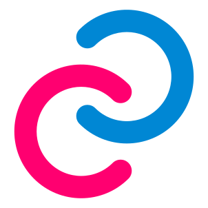

<h1>
  Repository per UDA sul gioco Pokémon, classe 4IA a.s. 2021-2022
  
</h1>

Link utili per il progetto

### Web Speech API:

* https://github.com/ITIS-Zuccante/web-speech-api
* https://tutorialzine.com/2017/08/converting-from-speech-to-text-with-javascript
* https://www.google.com/intl/en/chrome/demos/speech.html
* https://cloud.google.com/speech-to-text/
* http://www.moreawesomeweb.com/demos/speech_translate.html
* https://mdn.github.io/web-speech-api/speak-easy-synthesis/

### Layout e stilizzazione con HTML e CSS:

* https://www.w3schools.com/css/default.asp
* https://htmlcheatsheet.com/css/
* https://websitesetup.org/css3-cheat-sheet/
* https://learnlayout.com/
* https://www.sitepoint.com/css-grid-generators/
* https://webflow.com/grid
* https://www.layoutit.com/build
* https://css-tricks.com/
* https://css-tricks.com/snippets/
* https://www.freecodecamp.org/news/css-grid-a-simple-layout-design-tutorial-5312a4a8bcaf/
* https://startbootstrap.com/templates/
* https://startbootstrap.com/snippets/

### Ambienti di sviluppo web-based e desktop per sviluppare progetti in HTML/CSS/JS:

* https://codepen.io/
* https://code.visualstudio.com/
* https://www.jetbrains.com/webstorm/

### Programmi per design e sketch di pagine web:

* https://www.figma.com/
* https://www.adobe.com/it/products/xd.html

### Panoramica sul Web Development

* https://www.youtube.com/watch?v=0pThnRneDjw
* https://www.youtube.com/watch?v=UnTQVlqmDQ0
* https://www.youtube.com/watch?v=gVXcqO9A1vo&t=363s
* https://coggle.it/diagram/WMMEvSoNyAABBX2w/t/web-development-in-2018/b97ca171d59ba2ab3b7ea8da244a8ed3a154ffa067568635fe2676068a1d44d0

### Accessibilità usabilità e validità del sito

* http://lau.csi.it/
* https://validator.w3.org/

### Esempi utili di HTML, CSS, JavaScript

* https://codepen.io/csb324/pen/MXVaLj
* https://pokemonshowdown.com/
* https://vuejsexamples.com/tag/pokemon/

### REST API

* https://blog.devgenius.io/best-practice-and-cheat-sheet-for-rest-api-design-6a6e12dfa89f
